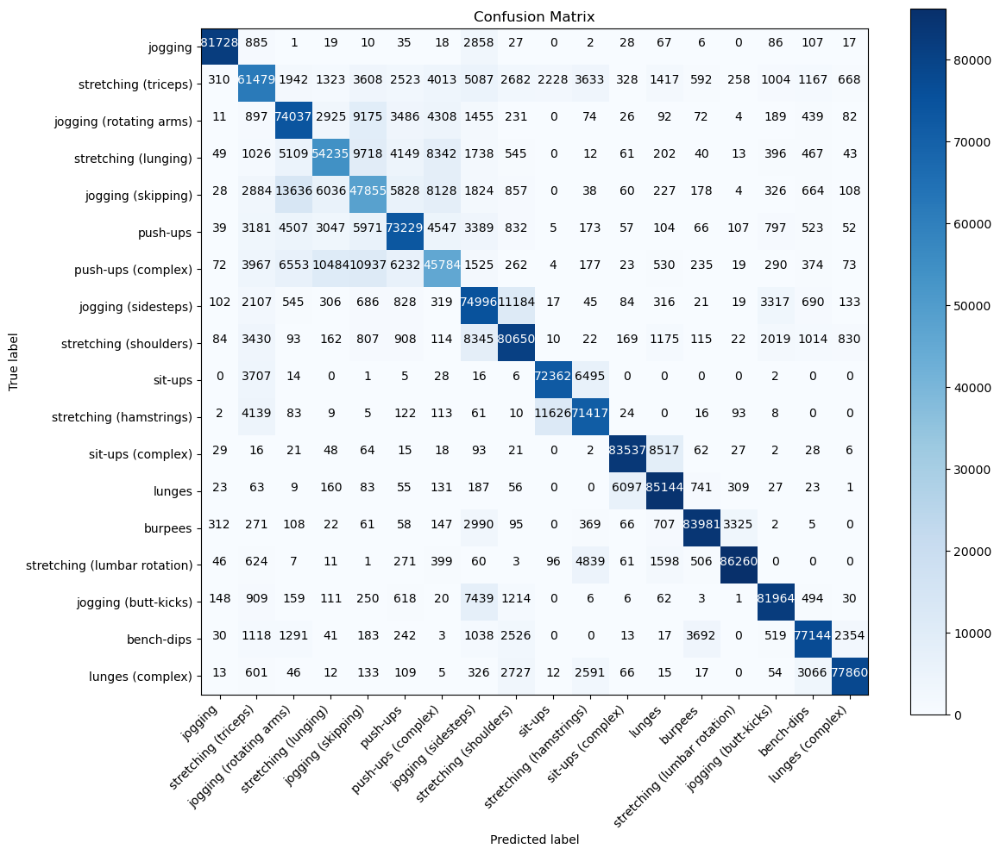

 This repository contains an N-BEATS deep learning model for classifying human activities from inertial sensor data in the WEAR dataset. The model uses a stack of fully connected layers optimized via hyperparameter tuning to achieve 79.57% test accuracy.

 ## Dataset
 The dataset used is the **WEAR dataset** for wearable and egocentric activity recognition, containing inertial (accelerometer) data from 22 participants performing 18 outdoor workout activities. The dataset is publicly available at [mariusbock.github.io/wear/](https://mariusbock.github.io/wear/) and hosted on GitHub at [mariusbock/wear](https://github.com/mariusbock/wear). Download the raw inertial data (CSV files `sbj_0.csv` to `sbj_17.csv`) and place them in the `data/wear/raw/inertial/` folder.
 **Note**: The WEAR dataset is licensed under CC BY-NC-SA 4.0, allowing non-commercial use with attribution.

 **Citation**:
 ```
 @article{bock2024wear,
   author = {Bock, Marius and Kuehne, Hilde and Van Laerhoven, Kristof and Moeller, Michael},
   title = {WEAR: An Outdoor Sports Dataset for Wearable and Egocentric Activity Recognition},
   journal = {Proc. ACM Interact. Mob. Wearable Ubiquitous Technol. (IMWUT)},
   volume = {8},
   number = {4},
   articleno = {175},
   year = {2024},
   doi = {10.1145/3699776}
 }
 ```

 ## Requirements
 Install the required Python libraries:
 ```bash
 pip install -r requirements.txt
 ```

 ## Usage
 1. Download the WEAR dataset’s raw inertial data from [mariusbock.github.io/wear/](https://mariusbock.github.io/wear/).
 2. Place the CSV files (`sbj_0.csv` to `sbj_17.csv`) in `data/wear/raw/inertial/`.
 3. Run `NBEATS.ipynb` to preprocess data, train the N-BEATS model, and evaluate performance.

 ## Results
 - **Test Accuracy**: 79.57%
 - **Average Precision**: 79.76%
 - **Average Recall**: 79.57%
 - **Average F1 Score**: 79.58%

 

 ## Model Architecture
 - **Input Layer**: Accepts preprocessed inertial sensor data.
 - **N-BEATS Blocks**: Multiple blocks of fully connected (Dense) layers with ReLU activation, tuned for units (64–256), number of blocks (2–4), and layers per block (2–4).
 - **Dropout**: Applied for regularization (tuned rate: 0.1–0.5).
 - **Output Layer**: Softmax layer for classifying 18 activities.

 ## License
 This project is licensed under the MIT License - see the [LICENSE](LICENSE) file for details.

 ## Contact
 For questions, contact Srinadh Alugu at srinadhalugu0508@gmail.
